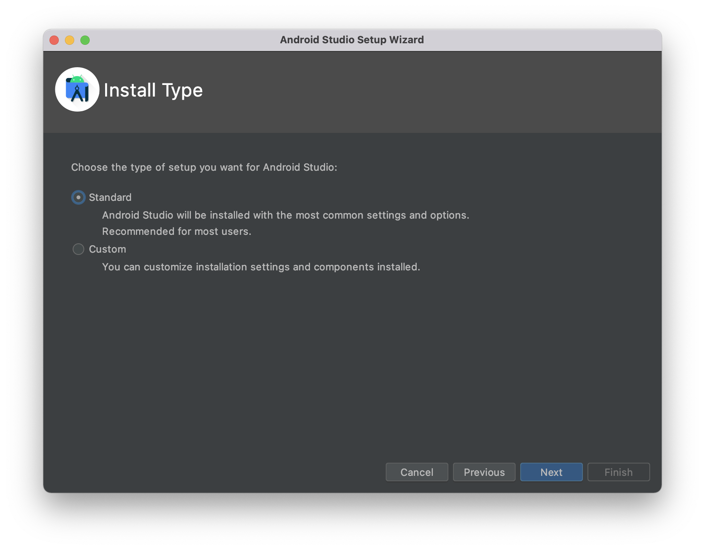

# Dart and FLutter installation

Follow this doc for dart and flutter installation and setup
https://docs.flutter.dev/get-started/install

## Android Studio setup and project creation
Download android studio from https://developer.android.com/studio

1) Open the executable
  

Select standard and proceed.

2) Click on finish
  

This will download all the required sdks, build tool and emulator.

3) Open settings and install **Android SDK Command-line Tools**
    
    ***`Setting > Plugins`***
  


4) Install flutter and dart plugins.

    ***`Setting > System Settings > Android SDK > SDK Tools`***
  

5) Creating flutter project
   
    ***`Home screen > New Flutter Project`***
  
and follow the project creation steps.

> On MacOS [Xcode](https://apps.apple.com/us/app/xcode/id497799835?mt=12) and [coco-pods](https://guides.cocoapods.org/using/getting-started.html#installation) installation is also required to build ios apps 


Run flutter doctor command to see if anything is missing.

``` bash
$ flutter doctor
```

